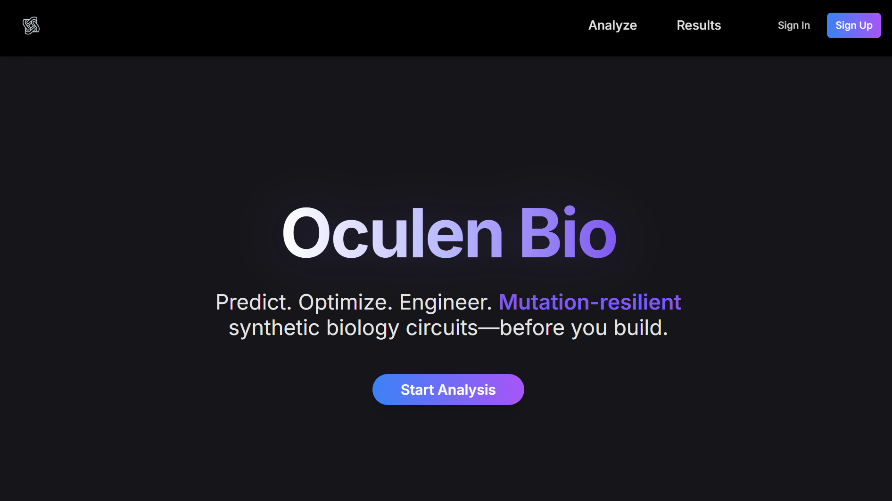
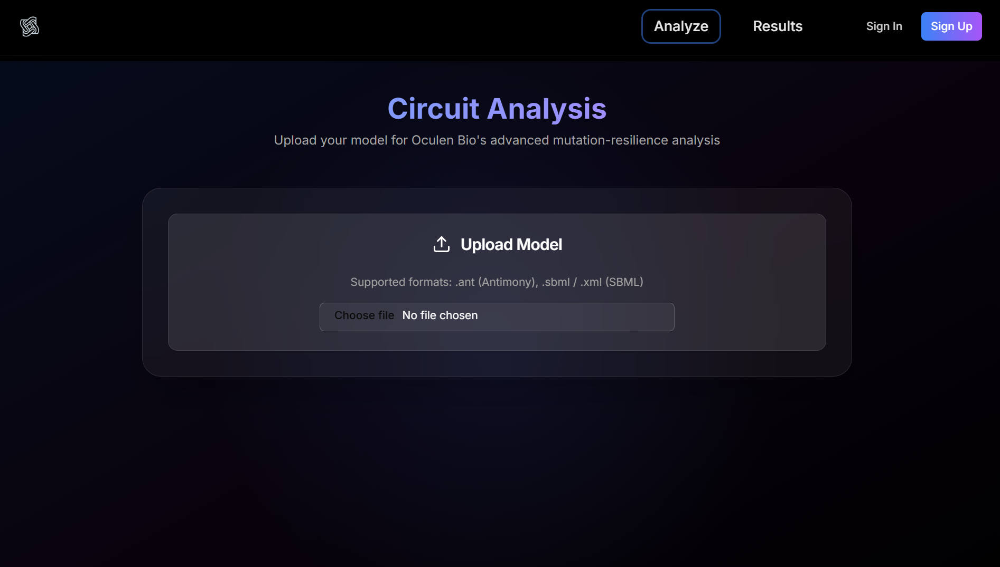
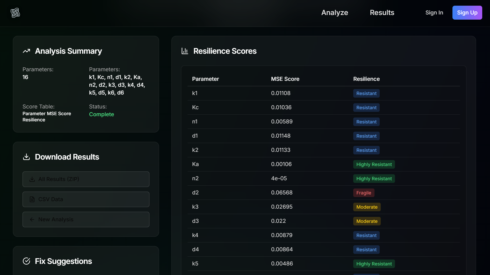
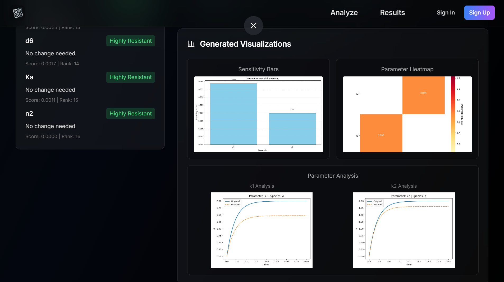

# 🧬 Oculen Bio — Mutation Resilience Analyzer for Genetic Circuits

**Website**: [https://oculen.bio](https://oculen.bio)  
**Built By**: Aditya Raj 

Oculen Bio is a full-stack synthetic biology platform that analyzes Antimony/SBML-based gene circuits for mutation fragility and robustness — all before wet lab testing begins.

---

## 🚀 Features

- 🔬 Upload Antimony or SBML code of your circuit
- 📊 Simulates multiple mutations and scores circuit fragility
- 🧠 AI-based suggestion engine recommends parameter fixes
- 🎯 Visuals include heatmaps, barplots, and fragility diagnostics
- 📁 Download full report with simulation graphs and mutation logs
- 🔒 Built 100% pre-college with no formal CS education

---

## 🔥 Tech Stack

- **Frontend**: React + Tailwind + Shadcn + Framer Motion
- **Backend**: FastAPI + Tellurium + Matplotlib
- **Dev Tools**: Cursor AI, GitHub, Vercel, Render
- **Built With**: Synthetic biology in mind — not generic simulation.

---

## 🧠 Why Oculen Exists

> Most genetic circuits fail in real conditions.  
> Oculen diagnoses fragility before failure, helping teams save time, cost, and effort — especially in iGEM teams, early-stage biostartups, and academic labs.

---

## 🔒 Source Code

The backend and frontend are **private for now** due to future commercialization plans.  
However, feel free to [contact me](mailto:adityaraj.kuro@gmail.com) or [connect on GitHub](https://github.com/blackbox-genesis) if you'd like a walkthrough or collaboration.

---

<h2 align="center">📸 Screenshots</h2>

<h4 align="center">🧬 Landing Page</h4>

  

<h4 align="center">🧪 Analyze Page</h4>

  

<h4 align="center">📊 Results Page</h4>

  
   
  

---

## 📩 Want to Collaborate?

If you're a bioengineer, developer, or researcher working on circuit design, robustness, or ML-driven synthetic biology — feel free to reach out!

